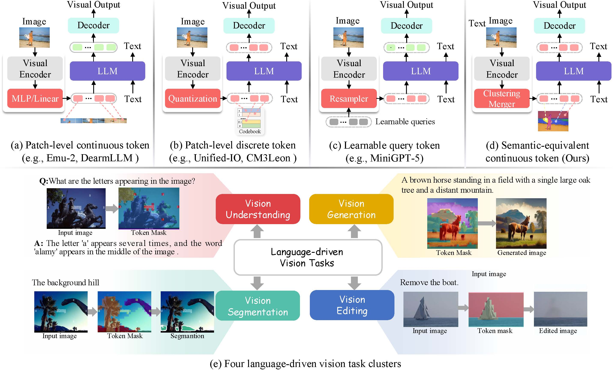

<br />
<p align="center">
  <h1 align="center">Towards Semantic Equivalence of Tokenization in Multimodal LLM</h1>
  <p align="center">
    <a href="https://chocowu.github.io"><strong>Shengqiong Wu</strong></a>
    ·
    <a href="https://haofei.vip/"><strong>Hao Fei</strong></a>
    ·
    <a href="https://lxtgh.github.io/"><strong>Xiangtai Li</strong></a>
    ·
    <a href="https://scholar.google.com/citations?user=xp_rICcAAAAJ&hl=zh-CN"><strong>Jiayi Ji</strong></a>
    ·
    <br/>
    <a href="https://personal.ntu.edu.sg/hanwangzhang/"><strong>Hanwang Zhang</strong></a>
    ·
    <a href="https://www.chuatatseng.com/"><strong>Tat-seng Chua</strong></a>
    ·
    <a href="https://yanshuicheng.info/"><strong>Shuicheng Yan</strong></a>
  </p>
  <p align="center" margin="0 auto">
    <small>National University of Singapore · Skywork AI, Singapore · 
    <br/> Nanyang Technological University</small>
  </p>
   <p align="center">
    <small><small>Work is done as an intern in Skywork AI, Hao Fei is the corresponding author.</small></small>
  </p>
  
  <p align="center">
    <a href='https://arxiv.org/abs/2406.05127'>
       </a>
    <a href='https://chocowu.github.io/SeTok-web/' style='padding-left: 0.5rem;'>
       </a>
  </p>
<br />




### Abstract

Multimodal Large Language Models (MLLMs) have demonstrated exceptional capabilities in processing vision-language tasks. One of the crux of MLLMs lies in vision tokenization, which involves efficiently transforming input visual signals into feature representations that are most beneficial for LLMs. However, existing vision tokenizers, essential for semantic alignment between vision and language, remain problematic. Existing methods aggressively fragment visual input, corrupting the visual semantic integrity. To address this, this paper proposes a novel dynamic `Semantic-Equivalent Vision Tokenizer` (**SeTok**), which groups visual features into semantic units via a dynamic clustering algorithm, flexibly determining the number of tokens based on image complexity. The resulting vision tokens effectively preserve semantic integrity and capture both low-frequency and high-frequency visual features. 


The proposed MLLM (**Setokim**) equipped with SeTok significantly demonstrates superior performance across various tasks, as evidenced by our experimental results.
<div align='center'>

</div>


<!--  -->


## 📂 Getting Start

First, prepare the code and set up the environment:
```
# download the code
git clone https://github.com/ChocoWu/SeTok.git
cd SeTok

# install
conda creat -n setok python=3.10 -y
conda activate setok
pip install --upgrade pip
pip install -e .
```

### 📚 Preparing Data

To begin, please prepare the dataset. All datasets should be placed under the [`data/`](./data) directory, with the following structure:
```
data
  - ImageNet-1K
    - data.json
    - images
      - xxx.jpg
  - OpenImages
  - ALLaVA
  - GQA
    - data.json
    - images
      - xxx.jpg
  - OK-VQA
  - ...
  - InstructPix2Pix
  - Magicbrush
```
For details on how each dataset is processed, please refer to the following scripts:

- [`TextImagePairDataset`](./src/dataset/pairDataset.py)
- [`EditingDataset`](./src/dataset/editDataset.py)
- [`InstructionTuningDataset`](./src/dataset/instructDataset.py)


### 🚀 Training
Our training receipts involves three stages. 

- **Stage-1: Setok tokenizer training**. We use ImageNet-1K for reconstruction learning and OpenImages for both reconstruction and alignment learning. 
```
# In [train_mem.py], activate Setok training:

from train_setok import train
train(attn_implementation="flash_attention_2")

# Set the hyper-parameters in [train_setok.sh].
bash  train_setok.sh
```
Make sure the dataset paths are correctly set in your config file or environment variables.


- **Stage-2: Multimodal Pretraining**. In this stage, we focus on enhancing the alignment between text and image. We employ massive multimodal data, including ImageNet-1K and 28M text-image pair dataset, to train our model for conditional image generation and image captioning.
```
# In [train_mem.py], activate Setok training:

from train_setokim import train
train(attn_implementation="flash_attention_2")

# Set the hyper-parameters in [pretrain_mm_proj.sh].
bash  pretrain_mm_proj.sh

```

- **Stage-3: Instruction Tuning**. Building upon the pretrained weights, we further perform multimodal instruction tuning with both public datasets covering
multimodal instruction datasets, fine-grained visual QA, and etc.
```
# Set the hyper-parameters in [finetune.sh].
bash  finetune.sh
```


## ✨ Citation

If you use **SeTok** in your project, please kindly cite:

```bibtex
@article{wu2024towards,
  title={Towards Semantic Equivalence of Tokenization in Multimodal LLM},
  author={Wu, Shengqiong and Fei, Hao and Li, Xiangtai and Ji, Jiayi and Zhang, Hanwang and Chua, Tat-Seng and Yan, Shuicheng},
  publisher={ICLR},
  year={2025}
}
```

## Acknowledgments

This work is heavily built based on [LLaVA](https://github.com/haotian-liu/LLaVA), [GroupViT](https://github.com/NVlabs/GroupViT), [MAR](https://github.com/LTH14/mar), [Blip-2](https://github.com/salesforce/LAVIS). 
Thanks to all the authors for their great work.